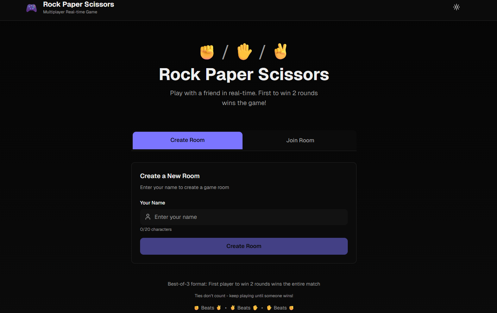

# Rock Paper Scissors - Real-Time Multiplayer Game

A modern, real-time multiplayer Rock Paper Scissors game built with Next.js, TypeScript, and Socket.io. Features dark mode, responsive design, and best-of-three gameplay.



## Features

- **Real-Time Multiplayer**: Play against another player in real-time using WebSockets
- **Room System**: Create or join game rooms with unique codes
- **Best of 3 Rounds**: First player to win 2 rounds wins the match
- **Dark Mode**: Toggle between light and dark themes with Zustand state management
- **Responsive Design**: Optimized for mobile, tablet, and desktop devices
- **Connection Status**: Real-time indicators showing player connection status
- **Notifications**: Toast notifications for game events (wins, losses, draws)
- **Rematch System**: Play again with the same opponent after a match
- **Tie Handling**: Ties don't count as rounds - play continues until someone wins

## Technologies Used

### Frontend

- **Next.js 16** - React framework with App Router
- **React 19.2** - UI library
- **TypeScript** - Type-safe JavaScript
- **Tailwind CSS v4** - Utility-first CSS framework
- **Zustand** - Lightweight state management
- **Socket.io-client** - WebSocket client for real-time communication
- **Lucide React** - Icon library

### Backend

- **Node.js** - JavaScript runtime
- **Express** - Web server framework
- **Socket.io** - WebSocket server for real-time bidirectional communication
- **TypeScript** - Type-safe server code

## Project Structure

```
├── app/
│   ├── layout.tsx          # Root layout with providers
│   ├── page.tsx            # Main game page
│   ├── providers.tsx       # Theme provider
│   └── globals.css         # Global styles and Tailwind config
├── components/
│   ├── header.tsx          # App header with theme toggle
│   ├── game/               # Game-related components
│   │   ├── game-view.tsx           # Main game view
│   │   ├── game-choices.tsx        # Rock/Paper/Scissors buttons
│   │   ├── game-results.tsx        # Final results screen
│   │   ├── game-menu.tsx           # Play again/Disconnect menu
│   │   ├── player-status.tsx       # Player info display
│   │   ├── round-info.tsx          # Round counter
│   │   └── connection-status.tsx   # Connection indicators
│   ├── lobby/              # Lobby/room components
│   │   ├── lobby-view.tsx          # Main lobby view
│   │   ├── create-room-section.tsx # Create room form
│   │   └── join-room-section.tsx   # Join room form
│   └── notifications/      # Notification system
│       ├── notifications-container.tsx
│       └── notification-toast.tsx
├── hooks/
│   ├── use-theme.ts        # Theme hook
│   └── use-notifications.ts # Notifications hook
├── lib/
│   ├── store.ts            # Zustand stores (theme + game state)
│   ├── socket-types.ts     # Socket.io event types and interfaces
│   ├── socket-client.ts    # Socket.io client setup
│   ├── game-logic.ts       # Game rules and logic
│   └── notification-store.ts # Notification state management
├── server/
│   └── index.ts            # Socket.io server with Express
└── README.md               # This file
```

## Installation and Setup

### Prerequisites

- Node.js 18+ installed
- npm or yarn package manager

### 1. Clone the repository

```bash
git clone <repository-url>
cd rock-paper-scissors-game
```

### 2. Install dependencies

```bash
npm install
# or
yarn install
```

### 3. Environment Variables

Create a `.env.local` file in the root directory:

```env
# Socket.io server URL (production)
NEXT_PUBLIC_SOCKET_URL=http://your-server-url:3001

# For local development, this is automatically set to http://localhost:3001
```

### 4. Run the project

#### Development Mode

You need to run **two commands** in separate terminals:

**Terminal 1 - Next.js Frontend:**

```bash
npm run dev
# or
yarn dev
```

The app will be available at `http://localhost:3000`

**Terminal 2 - Socket.io Server:**

```bash
npm run server
# or
yarn server
```

The WebSocket server will run at `http://localhost:3001`

> **Note:** You need to add the `server` script to your `package.json`:

```json
{
  "scripts": {
    "dev": "next dev",
    "build": "next build",
    "start": "next start",
    "server": "tsx watch server/index.ts"
  }
}
```

Also install `tsx` for running TypeScript directly:

```bash
npm install -D tsx
```

#### Production Mode

```bash
# Build the Next.js app
npm run build

# Start the Next.js production server
npm start

# In another terminal, start the Socket.io server
npm run server
```

## How to Play

1. **Player 1 (Host)**:

   - Enter your name
   - Click "Create Room"
   - Copy the generated room code and share it with Player 2

2. **Player 2 (Guest)**:

   - Enter your name
   - Enter the room code from Player 1
   - Click "Join Room"

3. **Gameplay**:

   - Both players select Rock, Paper, or Scissors
   - Results are shown in real-time
   - First to win 2 rounds wins the match
   - Ties don't count as rounds

4. **After Match**:
   - Use the menu buttons to "Play Again" or "Disconnect"
   - Both players must agree to play again for a rematch

## Game Rules

- **Rock** beats **Scissors**
- **Scissors** beats **Paper**
- **Paper** beats **Rock**
- Same choices result in a **Tie** (round doesn't count)
- Best of 3: First player to win **2 rounds** wins the match

## Future Enhancements

This project is structured to support future features:

- **Database Integration**: Ready for Prisma ORM + PostgreSQL
- **User Authentication**: Player accounts and login system
- **Match History**: Track past games and statistics
- **Leaderboards**: Global and friend leaderboards
- **Tournament Mode**: Multi-player bracket tournaments
- **Custom Avatars**: Player profile customization

## Deployment

### Vercel (Frontend)

```bash
vercel deploy
```

### Server Deployment

Deploy the Socket.io server separately on platforms like:

- Railway
- Render
- Heroku
- DigitalOcean

Update the `NEXT_PUBLIC_SOCKET_URL` environment variable to point to your deployed server.

## Contributing

Contributions are welcome! Please feel free to submit a Pull Request.

## License

MIT License - feel free to use this project for learning or commercial purposes.

## Credits

Built with ❤️ using modern web technologies and best practices.
